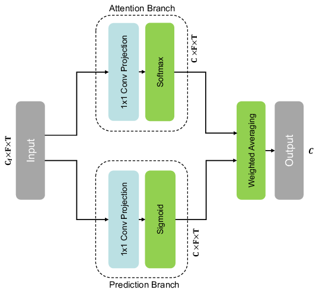
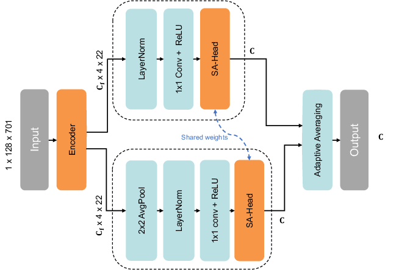

# Spectrogram Attention for Acoustic Bird Species Recognition

[](https://github.com/pre-commit/pre-commit)
[](https://pytorch.org/get-started/locally/)

This repository contains the official implementation of **Spectrogram Attention for Acoustic Bird Species Recognition**. The proposed Deep learning approach introduces **Spectrogram Attention (SA)**, a novel mechanism for jointly modeling fine-grained spectro-temporal patterns in log-mel spectrograms using feature maps extracted from a pretrained convolutional neural network. The model is pretrained on a large-scale corpus of **9,735 bird species** from the Xeno-Canto dataset and subsequently fine-tuned on **eight BirdSet soundscape corpora** under three different training regimes.

<div align="center">
  
  
</div>

---

# Table of Contents

- [Project Structure](#project-structure)
- [Requirements](#requirements)
- [Datasets](#datasets)
- [Checkpoints](#checkpoints)
- [Model Demo](#model-demo)
- [Validation](#validation)
- [Citation](#citation)


---

# Project Structure

```
sa4birds/
│
├── checkpoints/              # pretrained model checkpoints
├── figures/                  # architecture figures
│
├── models/                   # model implementations
│
├── validate.py               # evaluation entry point
├── prepare_checkpoints.py    # download checkpoints
│
├── model_demo.ipynb          # model usage example
├── evaluation_demo.ipynb     # evaluation example
│
├── requirements.txt
└── README.md
```


## Requirements

This project requires **Python 3+** and is designed to run on a **CUDA-capable GPU** due to the size of the models trained (**>50 million parameters**). CPU execution is technically supported but strongly discouraged, as processing times will be extremely long.

### System Requirements
- **Python:** > 3.0 (recommended: Python 3.9+)
- **GPU (recommended):** NVIDIA GPU with CUDA support
- **CUDA Toolkit:** Compatible with your installed ML framework (e.g., PyTorch)
- **NVIDIA Drivers:** Required for CUDA support

### Python Dependencies
The project relies on the following main packages (see `requirements.txt` for the complete list):
```text
datasets
hydra-core
librosa
numpy
scikit-learn
soundfile
timm
torch
torchaudio
torchmetrics
torchvision
transformers
```

Install the required Python packages listed in **`requirements.txt`**:

```bash
pip install -r requirements.txt
```

### Memory requirements

Due to the use of **BirdSet** (see [Datasets](#datasets)) for evaluation across all tasks, approximately **160 GB of memory** is required, in addition to **8.5 GB** for storing all trained models.
<!--
| Regime  | Space (GB) |
|---------|------------|
| **HSN** | 6.7        |
| **POW** | 17         |
| **SNE** | 23         |
| **PER** | 12         |
| **NES** | 16         |
| **UHH** | 6.6        |
| **UHH** | 31        |
| **SSW** | 45         |
-->

## Datasets

Training and evaluation primarily rely on the **[BirdSet](https://github.com/DBD-research-group/BirdSet)** benchmark.

BirdSet contains eight downstream tasks, each consisting of:

- **Training data:** weakly labeled recordings from **Xeno-Canto**
- **Test data:** strongly annotated **regional soundscapes**

For details see the **[BirdSet paper](https://arxiv.org/abs/2403.10380)**.

Datasets are automatically downloaded via the HuggingFace `datasets` library.

Example:

```python
import datasets 

down_task = "HSN"
datasets.load_dataset("DBD-research-group/BirdSet", down_task)
```

Cached datasets are stored in:

```
~/.cache/huggingface/
```


The following datasets are used as no-call samples during training: 

- [Freefield1010](https://dcase.community/challenge2018/task-bird-audio-detection)
- [ESC-50](https://github.com/karolpiczak/ESC-50) 
- [BirdVox-DCASE-20k](https://dcase.community/challenge2018/task-bird-audio-detection) 


## Checkpoints

Pretrained checkpoints are available for three training regimes:

| Regime | Description                               |
|--------|-------------------------------------------|
| **DT** | Dedicated training (task-specific models) |
| **MT** | Medium multi-task training                |
| **LT** | Large multi-task training                 |

Download the model checkpoints and place them in the `checkpoints` directory, organized by training regime (`DT`, `MT`, or `LT`).


| Training Regime |   Task    |                                Url                                |
|:---------------:|:---------:|:-----------------------------------------------------------------:|
|    Dedicated    |    HSN    | [Download](https://next.hessenbox.de/index.php/s/KR92DHDjYCSMREc) |
|    Dedicated    |    POW    | [Download](https://next.hessenbox.de/index.php/s/fYKk7FDG446jgxD) |
|    Dedicated    |    SNE    | [Download](https://next.hessenbox.de/index.php/s/7YRQ2NopSGmsxFX) |
|    Dedicated    |    PER    | [Download](https://next.hessenbox.de/index.php/s/dKjJgk3WEpFGpf4) |
|    Dedicated    |    NES    | [Download](https://next.hessenbox.de/index.php/s/GHMrTbregzZ66CE) |
|    Dedicated    |    UHH    | [Download](https://next.hessenbox.de/index.php/s/Jr3KWKMMJyF4Zgb) |
|    Dedicated    |    NBP    | [Download](https://next.hessenbox.de/index.php/s/qKmMDPyQSzRRzoo) |
|    Dedicated    |    SSW    | [Download](https://next.hessenbox.de/index.php/s/GPk5MdGsLikmHKa) |
|     Medium      | All tasks | [Download](https://next.hessenbox.de/index.php/s/ck8J8A95DdssSo4) |
|      Large      | All tasks | [Download](https://next.hessenbox.de/index.php/s/xxE5XTaNcHCXidy) |


Download checkpoints manually or run:

```bash
python prepare_checkpoints.py
```

This will download all the trained checkpoints with the following structure:

```
sa4birds/
│
├── checkpoints/                         # pretrained model checkpoints
│   ├── DT/
│   │   └── HSN/                         # downstream task name
│   │       ├── HSN_eca_nfnet_l1_2025-10-20_112131/   # DT HSN first model checkpoint
│   │       └── ...
│   │
│   ├── MT/
│   │   ├── MT_eca_nfnet_l1_2025-11-25_151907/        # MT first model checkpoint
│   │   └── ...
│   │
│   └── LT/
│       ├── LT_eca_nfnet_l1_2025-11-24_180849/        # LT first model checkpoint
│       └── ...
```


## Model Demo
A demonstration of how to run one of the trained model is provided in the notebook:

```
model_demo.ipynb
```

This notebook shows how to:

- load the trained model
- run model 
- inspect the outputs

To run the demo notebook, install Jupyter:

```bash
pip install jupyterlab
```

### Launching Jupyter

Start the Jupyter notebook server from the project directory:

```bash
jupyter lab
```

Your browser will open automatically. Then open:

```
inference_example.ipynb
```

and run the cells to see the model in action.

---

## Validation

After installing the dependencies listed in `requirements.txt`, you can evaluate a model on a specific downstream task by first downloading the model checkpoints and placing them in the `checkpoints` director. Use the following to download all checkpoints: 

```bash
python prepare_checkpoints.py
```

You can then run the evaluation using `evaluate.py`. For example, to evaluate on **HSN** using the **DT** regime run:

```bash
python validate.py mode=DT downtask=HSN
```

To evaluate on all Birdset downtasks: 

```bash
python validate.py mode=DT downtask=ALL
```

A demonstration of how to evaluate a trained model is provided in the notebook:

```
evaluation_demo.ipynb
```